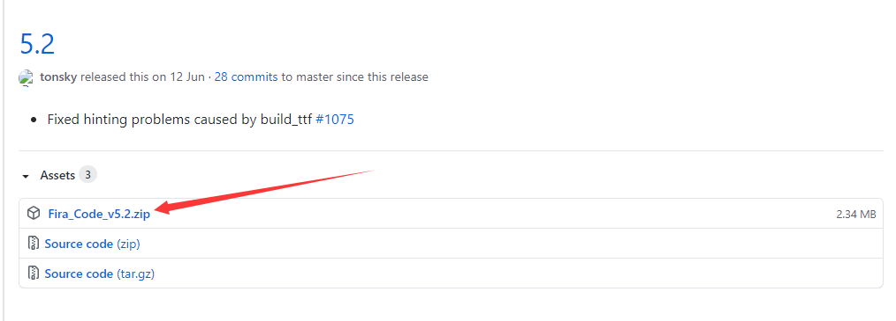

# 环境搭建

## 下载 Cmder 终端

访问 https://cmder.net/

点击 Download Full, 下载 cmder.zip ，下载完解压即可使用。

## yarn、yrm 的安装

### 安装 yarn

\$ npm install -g yarn

### 安装 yrm

\$ npm install -g yrm

列出可用源：

\$ yrm ls

切换到 taobao 镜像源：

\$ yrm use taobao

## git 的使用

### git 本地与服务器进行绑定

绑定用户名输入：

\$ git config --global user.name "你注册 github 的账号"

绑定邮箱输入：

\$ git config --global user.email "你注册 github 的邮箱"

创建 SSH KEY 输入：

\$ ssh-keygen -t rsa -C "你的邮箱号码"。

登陆 GitHub，打开“settings”，“SSH and GPG keys”，然后点“New SSH Key”，填上 Title，在 Key 文本框里粘贴 id_rsa.pub 文件的内容。

访问 https://www.cnblogs.com/ymd12103410/p/11031346.html

### 将项目从 GitHub 克隆下来

第一步：在本地新建一个文件夹，作为本地仓库，如“demo”。打开 git，输入命令：

\$ cd /c/Users/Administrator/Desktop/demo

然后按回车键进入到该文件夹目录下。

第二步：将本地仓库初始化，命令：

\$ git init

第三步：将你需要的项目从 github 或者服务器上克隆下来，命令：

\$ git clone url

url 为项目服务器地址或 github 地址。

看到上面显示 100%就克隆好了。

克隆好之后进入项目目录，输入：

\$ yarn

依赖下载好后，根据协作规范创建分支开始开发。

访问 https://jingyan.baidu.com/article/642c9d343c7ee0644b46f76a.html

### 代码提交到本地步骤

查看代码变动:

\$ git status

将代码从工作区提交到暂存区：

\$ git add .

提交代码：

\$ git cz

git cz 教程参考文档： https://segmentfault.com/a/1190000020924364?utm_source=tag-newest

### 项目提交远程仓库步骤

第一步：在本地新建分支。

\$ git branch -b [分支名]

第二步：推送到远程仓库(推送到远程仓库前 git pull 拉取代码)。

\$ git push --set-upstream origin [分支名]

第三步：在 github 上发起合并分支请求。

不要提交到主分支，切换到 develop 分支后，点击 Compare & pull request ,选择审核人，点击提交。

## 下载 Fira_code 字体

访问 https://github.com/tonsky/FiraCode/releases

下载全选文件解压安装就可以使用了。

## VScode 环境搭建

### 安装插件

在 VScode 左边导航栏中找到拓展，然后搜索 Prettier - Code formatter
、Atom One Dark Theme、 Material Icon Theme、 Bracket Pair Colorizer 2、ES7 React/Redux/GraphQL/React-Native snippets 并下载。

### 代码风格

在左边导航栏最下面的管理中搜索“连”字，然后点击“在 settings.json 中编辑”，把"editor.fontLigatures"改为 true。

在左边导航栏最下面的管理中点击设置，常用设置中 font-size 改为 16，颜色主题改成“Atom One Dark”。

在设置中搜索 format,勾选 Editor: Format On Save。

## 统一提交代码格式

### 安装 Commitizen cli 工具

\$ npm install commitizen -g

访问 https://github.com/commitizen/cz-cli
