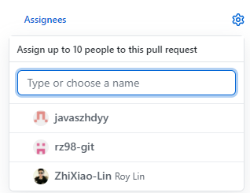

# 环境搭建

## yarn、yrm的安装

### 安装yarn

$ npm install -g yarn

### 安装yrm

$ npm install -g yrm

列出可用源：

$ yrm ls

切换到taobao镜像源：

$ yrm use taobao

## git的使用

### git本地与服务器进行绑定

绑定用户名输入：

$ git config --global user.name "你注册github的账号" 

绑定邮箱输入：

$ git config --global user.email "你注册github的邮箱" 

创建 SSH KEY 输入： 

$ ssh-keygen -t rsa -C "你的邮箱号码"。

登陆GitHub，打开“settings”，“SSH and GPG keys”，然后点“New SSH Key”，填上Title，在Key文本框里粘贴id_rsa.pub文件的内容。

访问  https://www.cnblogs.com/ymd12103410/p/11031346.html

### 将项目从GitHub克隆下来

第一步：在本地新建一个文件夹，作为本地仓库，如“demo”。打开git，输入命令：

$ cd /c/Users/Administrator/Desktop/demo  

然后按回车键进入到该文件夹目录下。

第二步：将本地仓库初始化，命令：

$ git init 

第三步：将你需要的项目从github或者服务器上克隆下来，命令：

$ git clone url 

url为项目服务器地址或github地址。

看到上面显示100%就克隆好了。

访问  https://jingyan.baidu.com/article/642c9d343c7ee0644b46f76a.html

### 项目提交步骤

第一步：在本地新建分支。

$ git branch -b [分支名]

第二步：推送到远程仓库。

$ git push --set-upstream origin [分支名]

第三步：在github上发起合并分支请求。

点击 Compare & pull request ,选择审核人，点击提交。

## 下载Cmder终端

访问 https://cmder.net/

点击 Download Full, 下载 cmder.zip ，下载完解压即可使用。

## VScode环境搭建

### 安装插件

在VScode左边导航栏中找到拓展，然后搜索 Atom One Dark Theme、 Material Icon Theme、 Bracket Pair Colorizer 2、ES7 React/Redux/GraphQL/React-Native snippets 并下载。

### 代码风格

在左边导航栏最下面的管理中搜索“连”字，然后点击“在settings.json中编辑”，把"editor.fontLigatures"改为true。

在左边导航栏最下面的管理中点击设置，常用设置中 font-size 改为16，颜色主题改成“Atom One Dark”。

## 统一提交代码格式

### 安装Commitizen cli工具

$ npm install commitizen -g

访问 https://github.com/commitizen/cz-cli
